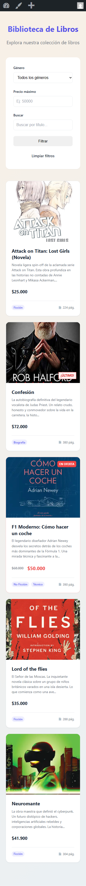
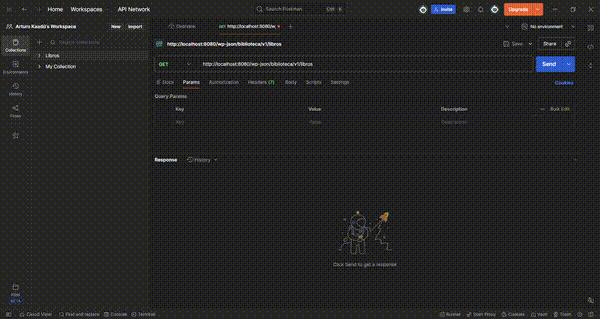
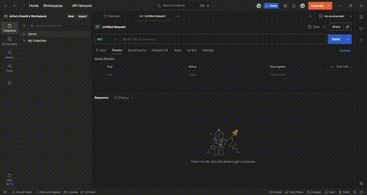

# Biblioteca WordPress

Challenge técnico de WordPress para demostrar conocimientos de desarrollo con PHP, Custom Post Types, REST API.

## Datos del Candidato

- **Nombre:** Arturo Kaadú
- **Fecha:** Enero 2026
- **Tiempo empleado:** ~16 horas

---

## Cómo Ejecutar

### 1. Levantar Docker

```bash
docker-compose up -d
```

### 2. Acceder al sitio

- **Frontend:** http://localhost:8080
- **Admin:** http://localhost:8080/wp-admin
- **Usuario/Contraseña:** Los que configure WordPress en la instalación inicial

### 3. Importar Campos ACF

1. En el admin, ir a **ACF > Herramientas**
2. Importar el archivo `acf-export/libro-fields.json`
3. Esto creará todos los campos personalizados del CPT Libro

### 4. Compilar SCSS (opcional, para desarrollo)

```bash
npm install
npm run watch:css  # Compila SCSS a CSS en tiempo real
```

> **Nota:** El archivo `assets/css/libros.css` ya está compilado y listo para usar. Solo es necesario ejecutar este paso si se realizan cambios en los archivos SCSS.

---

## Estructura del Proyecto

```
biblioteca-wordpress/
├── functions.php           # Configuración principal del tema
├── header.php              # Cabecera HTML con wp_head()
├── footer.php              # Pie de página con wp_footer()
├── single-libro.php        # Detalle de un libro individual
├── archive-libro.php       # Listado de libros con filtros
├── taxonomy.php            # Listado por género o autor
├── inc/
│   ├── post-types.php      # CPT Libro + Taxonomías
│   └── rest-api.php        # API REST custom
├── assets/
│   ├── scss/               # Archivos fuente SCSS (BEM)
│   │   ├── main.scss
│   │   ├── abstracts/
│   │   ├── base/
│   │   ├── components/
│   │   ├── layout/
│   │   └── pages/
│   └── css/
│       └── libros.css      # CSS compilado desde SCSS
└── acf-export/             # Campos personalizados ACF
```

---

## Archivos Principales y Por Qué

### `single-libro.php`

Template para la vista de detalle de un libro. Incluye:

- Imagen de portada, título, autor, precio
- Badge de oferta si aplica
- Badge "¡Último en stock!" si `stock_disponible == 1`
- Descripción (usando excerpt)
- Sección de reseñas con comentarios
- **"También te podría gustar"**: Custom query que busca libros del mismo género. Si no encuentra, hace fallback a libros aleatorios.

### `archive-libro.php`

Listado de libros con:

- Filtros por género, precio máximo y búsqueda
- WP_Query personalizada con sanitización
- Cards responsive con toda la información requerida
- Paginación

### `taxonomy.php`

Template genérico para taxonomías. Muestra libros filtrados por género o autor cuando el usuario hace click en un badge.

### `inc/rest-api.php`

API REST custom con 3 endpoints:

- `GET /biblioteca/v1/libros` - Lista con filtros
- `GET /biblioteca/v1/libros/{id}` - Detalle con reseñas
- `GET /biblioteca/v1/generos` - Lista de géneros

---

## Capturas

### Archivo de Libros (Desktop)


### Detalle de Libro


### Vista Mobile



### API en Postman






---

## API REST - Endpoints

### Listar libros

```
GET /wp-json/biblioteca/v1/libros
```

Parámetros opcionales:

- `genero` - Filtrar por slug de género (ej: `?genero=ficcion`)
- `precio_max` - Precio máximo (ej: `?precio_max=30000`)
- `search` - Buscar por título (ej: `?search=confesion`)
- `per_page` - Libros por página (default: 10)
- `page` - Número de página

**Respuesta ejemplo:**

```json
{
  "success": true,
  "data": [
    {
      "id": 35,
      "titulo": "Attack on Titan: Lost Girls",
      "slug": "attack-on-titan-lost-girls-novela",
      "excerpt": "Novela ligera spin-off...",
      "generos": ["ficcion"],
      "autores": ["Hiroshi Seko / Hajime Isayama"],
      "precio": 25000,
      "en_oferta": false
    }
  ],
  "pagination": { "total": 5, "pages": 1, "current_page": 1 }
}
```

### Detalle de libro

```
GET /wp-json/biblioteca/v1/libros/{id}
```

Incluye todos los campos ACF, reseñas y rating promedio.

### Listar géneros

```
GET /wp-json/biblioteca/v1/generos
```

**Respuesta ejemplo:**

```json
{
  "success": true,
  "data": [
    { "id": 5, "nombre": "Biografía", "slug": "biografia", "count": 1 },
    { "id": 2, "nombre": "Ficción", "slug": "ficcion", "count": 3 }
  ]
}
```

---

## Decisiones Técnicas

### SCSS + BEM

Se usó SCSS en lugar de CSS plano por:

- **Modularidad:** Archivos separados por componente (`_cards.scss`, `_badges.scss`, etc.)
- **Mantenibilidad:** Variables para colores, tipografía, espaciados
- **BEM:** Naming convention que evita conflictos de especificidad

El SCSS compila a `assets/css/libros.css` que es lo que WordPress carga.

### Sintaxis `endwhile;` / `endif;`

Se usa la sintaxis alternativa de PHP en templates porque mejora la legibilidad cuando se mezcla PHP con HTML. Es la convención recomendada en WordPress Core.

### Libros Relacionados con Fallback

La query de "También te podría gustar" primero busca libros del mismo género. Si no encuentra resultados (ej: el libro es el único de su género), hace una segunda query sin filtro de género para mostrar libros aleatorios. Evita mostrar la sección vacía.

### Carga Condicional de CSS

En `functions.php`, el CSS solo se carga en páginas de libros (`is_singular('libro')`, `is_post_type_archive('libro')`, `is_tax()`). Mejora performance al no cargar estilos innecesarios en otras páginas.

### Fondo Animado (Mesh Gradient)

Se agregó un gradient animado sutil en el fondo para dar un toque visual moderno sin distraer del contenido.

```scss
background: linear-gradient(-45deg, #f8f9fa, #e8eef3, #dfe6ed, #f0f4f8);
animation: meshGradient 15s ease infinite;
```

---

## Problemas Encontrados

### 1. Theme sin `header.php` es deprecated

**Problema:** WordPress 6.x muestra warning si el tema no tiene `header.php` y `footer.php`.

**Solución:** Se crearon ambos archivos con `wp_head()` y `wp_footer()` respectivamente. Sin estos hooks, los estilos y scripts no se cargan.

### 2. Clases CSS no aplicaban a las cards

**Problema:** El SCSS usaba naming BEM (`libro-card__titulo`) pero el HTML usaba clases diferentes (`libro-titulo`).

**Solución:** Se alinearon todas las clases del HTML con el naming BEM del SCSS.

### 3. "También te podría gustar" no mostraba resultados

**Problema:** La query filtraba por género (`tax_query`), pero si el libro era el único de su género, no encontraba otros libros.

**Solución:** Se agregó fallback. Si la primera query no encuentra resultados, se ejecuta una segunda sin filtro de género.

### 4. Variable `$current_id` fuera de scope

**Problema:** Las secciones de reseñas y libros relacionados estaban fuera del `while` loop principal, perdiendo acceso a `$current_id`.

**Solución:** Se movió el `endwhile` al final del template, después de todas las secciones que necesitan datos del post actual.

### 5. `sanitize_callback` con `floatval` en REST API

**Problema:** Al usar `'sanitize_callback' => 'floatval'` en los argumentos de la REST API, WordPress lanzaba error porque pasa 3 argumentos al callback pero `floatval()` solo acepta 1.

**Solución:** Envolver en closure: `'sanitize_callback' => function($value) { return floatval($value); }`

---

## Respuestas Teóricas

Ver archivo [RESPUESTAS.md](./RESPUESTAS.md) con las respuestas a las preguntas teóricas del challenge.

---

## Anexo: Uso de Herramientas de IA

Para este proyecto se utilizó asistencia de IA en las siguientes áreas:

- Organización de archivos SCSS/BEM
- Animaciones CSS (mesh gradient)
- Estructura base de documentación
- Debugging de scope de variables PHP
